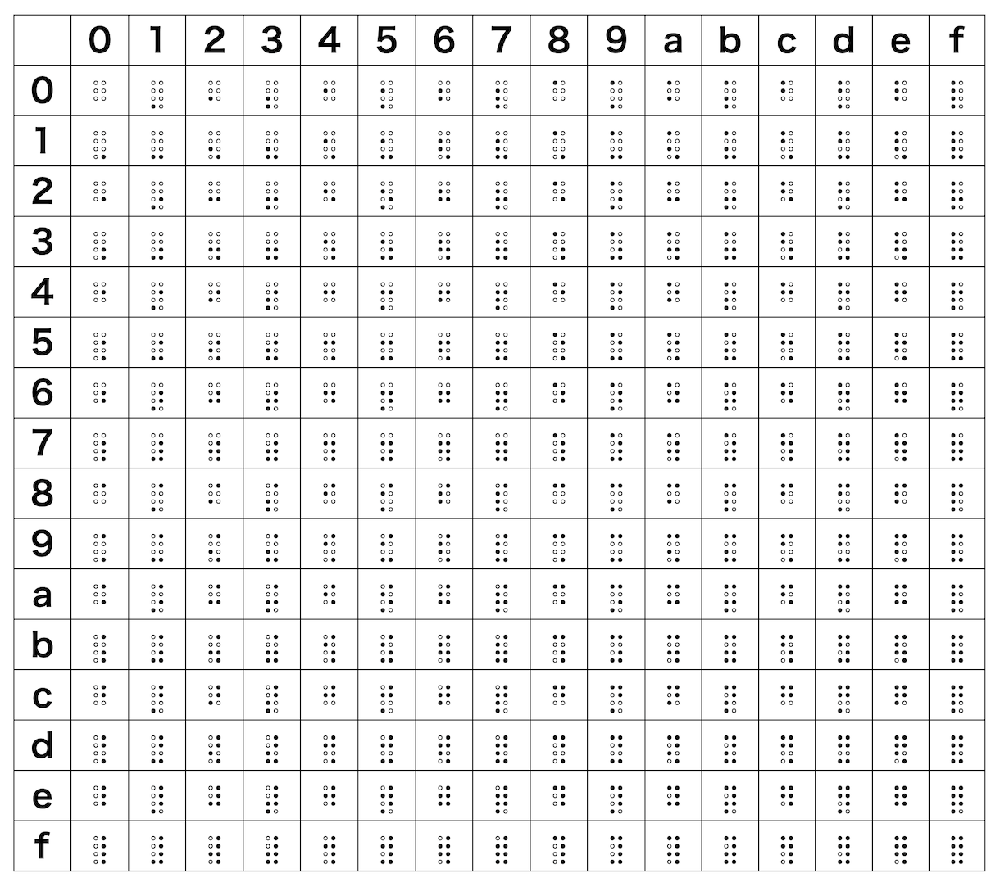

# Base256B braille-encode encoding/decoding ES module for JavaScript

- Base256B is an ES module for [braille-encode](https://github.com/qntm/braille-encode/) by [qntn](https://github.com/qntm), 8bit encoding with braille characters (0x2800-0x28FF in unicode)



[Base256B braille-encode char map](https://code4fukui.github.io/Base256B/)

One of the primary purposes is to have aesthetically pleasing SHA1 hashes. Compare:

- Hex:    `17057684bea1f9331418b633a8f373119d765fd4`
- B64:    `FwV2hL6h+TMUGLYzqPNzEZ12X9Q=`
- B32:    `RJ56_U1WM_LTT5_3TQH_K4P0_YJ4L_UTKD_3ZZZ_ZW`
- B16384: `叕蒄綨涓婐暶嫪崷婆歶旴`
- B256B:  `⣰⢐⡶⠑⡽⢅⣏⣤⡐⡈⡵⣤⠍⣧⣦⣀⣙⡶⣺⡓`

## Getting started

In your code:

```javascript
import { Base256B } from "https://code4fukui.github.io/Base256B/Base256B.js";

const encoded = Base256B.encode(new Uint8Array([1, 2, 3, 4]));
console.log(encoded);
const decoded = Base256B.decode(encoded);
console.log(decoded);

const key = new Uint8Array(32); // 32byte -> 32chars
crypto.getRandomValues(key);
const encoded2 = Base256B.encode(key);
console.log(encoded2); // ⢉⠶⠧⢢⡜⢈⠨⣗⢃⠇⡲⡙⠭⡤⡥⣁⡛⡘⣐⡢⣶⢠⠟⠛⠻⠔⠳⡀⠿⢧⡶⣠
```

## reference

- [qntm/braille-encode: Represent binary data as Braille](https://github.com/qntm/braille-encode/tree/main)
- [点字 - Wikipedia](https://ja.wikipedia.org/wiki/%E7%82%B9%E5%AD%97#Unicode)
- [code4fukui/Base16384](https://github.com/code4fukui/Base16384)
- [code4fukui/Base32: Base32 uppercase encoding for JavaScript, based (loosely) on Crockford's Base32](https://github.com/code4fukui/Base32)
- [qntm/hexagram-encode: Represent binary data using I Ching hexagrams](https://github.com/qntm/hexagram-encode)
- [base256エンコード - Qiita](https://qiita.com/Nabetani/items/6bcd03171d1dd2cb1817)
- [fabiospampinato/base256-encoding: Base256 encoding, the most memory-efficient encoding possible in JavaScript.](https://github.com/fabiospampinato/base256-encoding)

